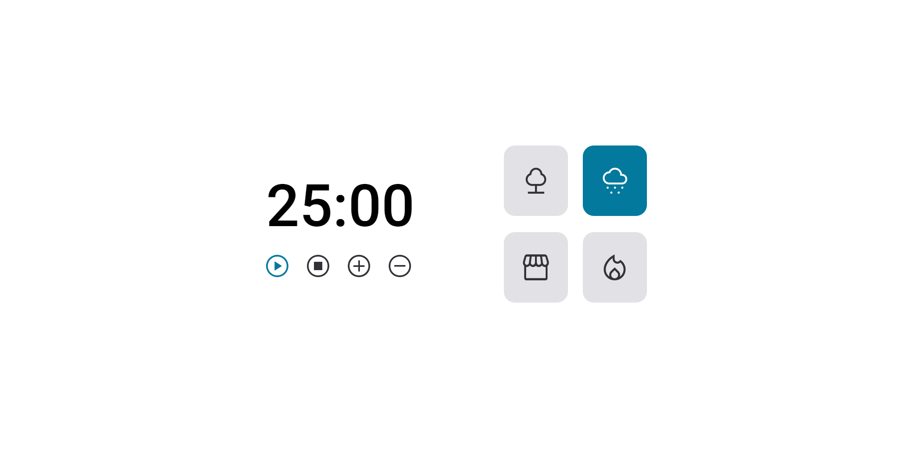

# Focus Timer ⏰

Projeto realizado no curso explore da rocketseat onde coloquei em práticas meus conhecimentos em JavaScript.
Nesse programa eu fiz um cronometro usando as técnicas pomodoro, onde o usuário escolhe o tempo desejado, e ainda pode colocar músicas de fundo para ajudar a concentrar.

[Acesse o projeto aqui!](https://gabriel-vitebo.github.io/focus-timmer/)

## Tecnologias 💻
- HTML 
- CSS
- JavaScript
- Git e Github

## O que aprendi 😁

- Criar funções ✔
- Adicionar eventos ✔
- refatorar ✔
- modulos ✔

## Contato 💌

vitebo@outlook.com 