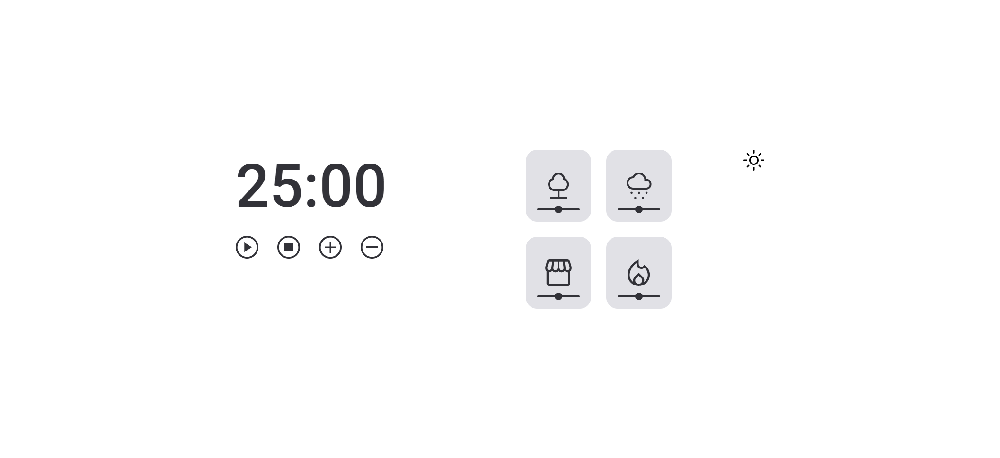
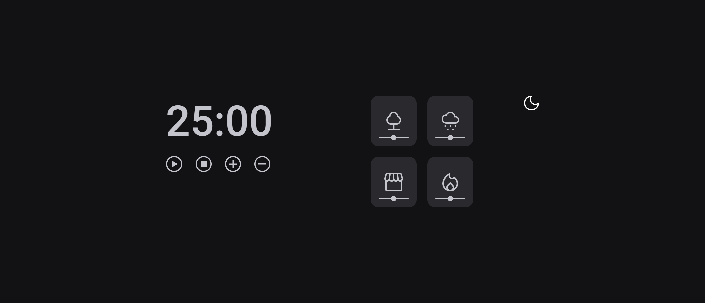

# Focus Timer ⏰

Projeto realizado no curso explore da rocketseat onde coloquei em práticas meus conhecimentos em JavaScript.
Nesse programa eu fiz um cronometro usando as técnicas pomodoro, onde o usuário escolhe o tempo desejado, e ainda pode colocar músicas de fundo para ajudar a concentrar.

 

[Acesse o projeto aqui!](https://gabriel-vitebo.github.io/focus-timmer/)

## O que consigo fazer nesse Timer?
 - Ao clicar no display, você pode configurar quantos minutos deseja, abaixo do display você encontra os controles para o timer, quando você clica no primeiro botão "play", aparecerá o botão de pause, ao lado está o botão para todo o timer, reiniciando o display. E por fim, estão dois botoes para acrescentar ou remover 5 minutos no timer.
- cada card ao lado contem um som, ao você clicar em um deles, irá tocar o som e você consegue ajustar o volume do jeito que sentir melhor
- e os ícones para ativar o dark mode ou o light mode, assim você pode usar o timer da maneira que sentir melhor

## Tecnologias 💻
- HTML 
- CSS
- JavaScript
- Git e Github

## O que aprendi 😁

- Criar funções ✔
- Adicionar eventos ✔
- refatorar ✔
- dark/light mode ✔
- modulos ✔

## Contato 💌

vitebo@outlook.com 